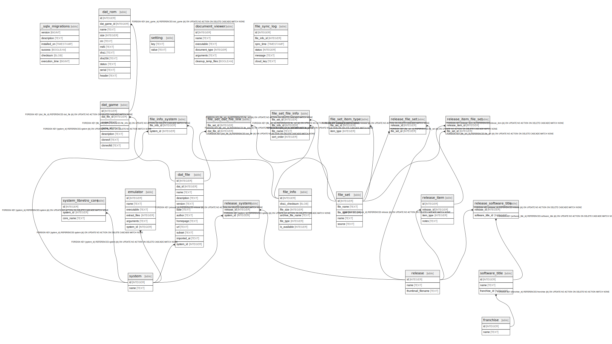

# db.sqlite

## Tables

| Name | Columns | Comment | Type |
| ---- | ------- | ------- | ---- |
| [_sqlx_migrations](_sqlx_migrations.md) | 6 |  | table |
| [system](system.md) | 2 |  | table |
| [emulator](emulator.md) | 6 |  | table |
| [franchise](franchise.md) | 2 |  | table |
| [software_title](software_title.md) | 3 |  | table |
| [release](release.md) | 2 |  | table |
| [file_info](file_info.md) | 5 |  | table |
| [file_set](file_set.md) | 5 |  | table |
| [file_set_file_info](file_set_file_info.md) | 4 |  | table |
| [release_file_set](release_file_set.md) | 2 |  | table |
| [setting](setting.md) | 2 |  | table |
| [document_viewer](document_viewer.md) | 6 |  | table |
| [release_system](release_system.md) | 2 |  | table |
| [release_software_title](release_software_title.md) | 2 |  | table |
| [file_info_system](file_info_system.md) | 2 |  | table |
| [file_sync_log](file_sync_log.md) | 6 |  | table |
| [release_item](release_item.md) | 4 |  | table |
| [release_item_file_set](release_item_file_set.md) | 2 |  | table |

## Relations

---

> Generated by [tbls](https://github.com/k1LoW/tbls)
