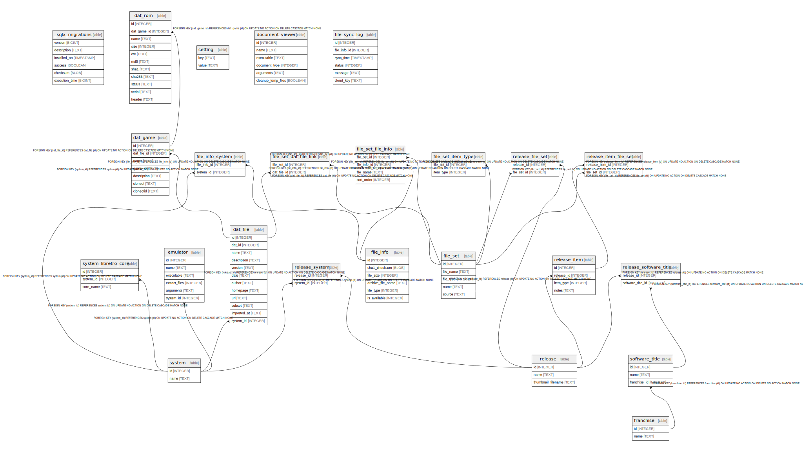

# db.sqlite

## Tables

| Name | Columns | Comment | Type |
| ---- | ------- | ------- | ---- |
| [_sqlx_migrations](_sqlx_migrations.md) | 6 |  | table |
| [system](system.md) | 2 | Platform/console systems (e.g., Commodore 64, Atari 2600) | table |
| [emulator](emulator.md) | 6 | Emulator configurations for running software on different systems | table |
| [franchise](franchise.md) | 2 | Game/software franchises (e.g., Zork, Jet Set Willy) | table |
| [software_title](software_title.md) | 3 | Individual software titles that can belong to a franchise | table |
| [release](release.md) | 3 | Specific releases of software (versions, editions, regions, compilations, different media) | table |
| [file_set](file_set.md) | 5 | Collections of files that belong together | table |
| [release_file_set](release_file_set.md) | 2 |  | table |
| [setting](setting.md) | 2 | Application settings stored as key-value pairs | table |
| [document_viewer](document_viewer.md) | 6 | Configuration for external document viewers | table |
| [release_system](release_system.md) | 2 |  | table |
| [release_software_title](release_software_title.md) | 2 |  | table |
| [file_info_system](file_info_system.md) | 2 |  | table |
| [file_sync_log](file_sync_log.md) | 6 | Tracking log for file synchronization operations | table |
| [release_item](release_item.md) | 4 |  | table |
| [release_item_file_set](release_item_file_set.md) | 2 |  | table |
| [file_set_item_type](file_set_item_type.md) | 2 |  | table |
| [dat_file](dat_file.md) | 12 |  | table |
| [dat_game](dat_game.md) | 7 |  | table |
| [dat_rom](dat_rom.md) | 11 |  | table |
| [file_set_dat_file_link](file_set_dat_file_link.md) | 2 |  | table |
| [file_set_file_info](file_set_file_info.md) | 4 |  | table |
| [system_libretro_core](system_libretro_core.md) | 3 |  | table |
| [file_info](file_info.md) | 6 | Metadata about files including checksums and sizes | table |

## Relations

---

> Generated by [tbls](https://github.com/k1LoW/tbls)
