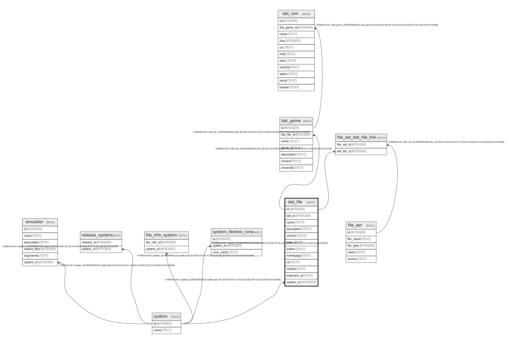

# dat_file

## Description

<details>
<summary><strong>Table Definition</strong></summary>

```sql
CREATE TABLE dat_file (
    id INTEGER PRIMARY KEY AUTOINCREMENT NOT NULL,
    dat_id INTEGER NOT NULL,
    name TEXT NOT NULL,
    description TEXT NOT NULL,
    version TEXT NOT NULL,
    date TEXT,
    author TEXT NOT NULL,
    homepage TEXT,
    url TEXT,
    subset TEXT,
    imported_at TEXT NOT NULL DEFAULT CURRENT_TIMESTAMP
, system_id INTEGER NOT NULL REFERENCES system(id) ON DELETE CASCADE)
```

</details>

## Columns

| Name | Type | Default | Nullable | Children | Parents | Comment |
| ---- | ---- | ------- | -------- | -------- | ------- | ------- |
| id | INTEGER |  | false | [dat_game](dat_game.md) [file_set_dat_file_link](file_set_dat_file_link.md) |  |  |
| dat_id | INTEGER |  | false |  |  |  |
| name | TEXT |  | false |  |  |  |
| description | TEXT |  | false |  |  |  |
| version | TEXT |  | false |  |  |  |
| date | TEXT |  | true |  |  |  |
| author | TEXT |  | false |  |  |  |
| homepage | TEXT |  | true |  |  |  |
| url | TEXT |  | true |  |  |  |
| subset | TEXT |  | true |  |  |  |
| imported_at | TEXT | CURRENT_TIMESTAMP | false |  |  |  |
| system_id | INTEGER |  | false |  | [system](system.md) |  |

## Constraints

| Name | Type | Definition |
| ---- | ---- | ---------- |
| id | PRIMARY KEY | PRIMARY KEY (id) |
| - (Foreign key ID: 0) | FOREIGN KEY | FOREIGN KEY (system_id) REFERENCES system (id) ON UPDATE NO ACTION ON DELETE CASCADE MATCH NONE |

## Indexes

| Name | Definition |
| ---- | ---------- |
| idx_dat_file_system_id | CREATE INDEX idx_dat_file_system_id ON dat_file(system_id) |

## Relations



---

> Generated by [tbls](https://github.com/k1LoW/tbls)
