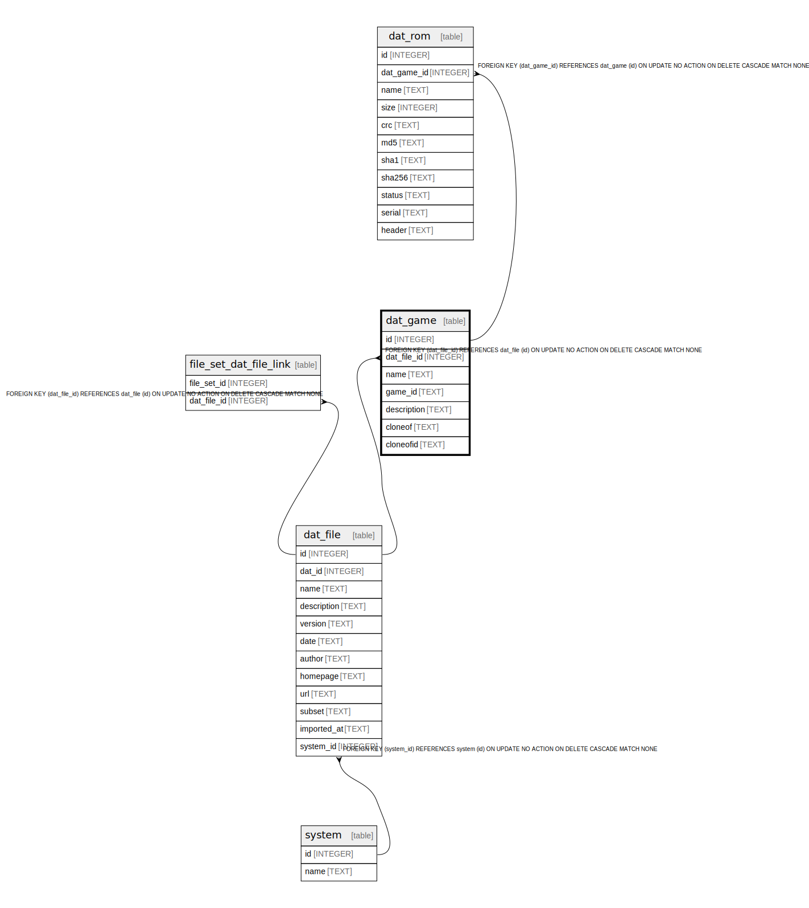

# dat_game

## Description

<details>
<summary><strong>Table Definition</strong></summary>

```sql
CREATE TABLE dat_game (
    id INTEGER PRIMARY KEY AUTOINCREMENT NOT NULL,
    dat_file_id INTEGER NOT NULL,
    name TEXT NOT NULL,
    game_id TEXT,
    description TEXT NOT NULL,
    cloneof TEXT,
    cloneofid TEXT,
    FOREIGN KEY (dat_file_id) REFERENCES dat_file(id) ON DELETE CASCADE
)
```

</details>

## Columns

| Name | Type | Default | Nullable | Children | Parents | Comment |
| ---- | ---- | ------- | -------- | -------- | ------- | ------- |
| id | INTEGER |  | false | [dat_rom](dat_rom.md) |  |  |
| dat_file_id | INTEGER |  | false |  | [dat_file](dat_file.md) |  |
| name | TEXT |  | false |  |  |  |
| game_id | TEXT |  | true |  |  |  |
| description | TEXT |  | false |  |  |  |
| cloneof | TEXT |  | true |  |  |  |
| cloneofid | TEXT |  | true |  |  |  |

## Constraints

| Name | Type | Definition |
| ---- | ---- | ---------- |
| id | PRIMARY KEY | PRIMARY KEY (id) |
| - (Foreign key ID: 0) | FOREIGN KEY | FOREIGN KEY (dat_file_id) REFERENCES dat_file (id) ON UPDATE NO ACTION ON DELETE CASCADE MATCH NONE |

## Indexes

| Name | Definition |
| ---- | ---------- |
| idx_dat_game_dat_file_id | CREATE INDEX idx_dat_game_dat_file_id ON dat_game(dat_file_id) |

## Relations



---

> Generated by [tbls](https://github.com/k1LoW/tbls)
