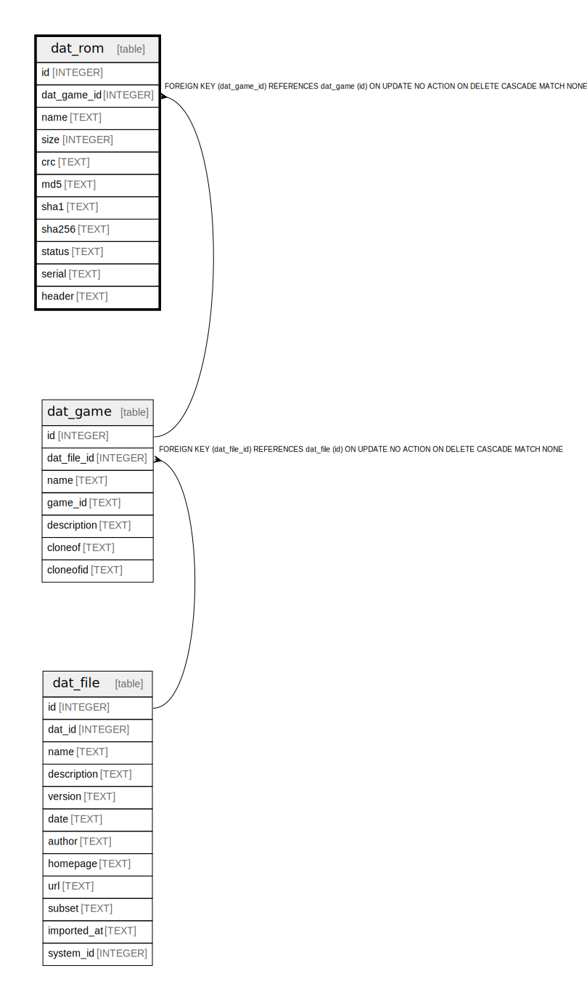

# dat_rom

## Description

<details>
<summary><strong>Table Definition</strong></summary>

```sql
CREATE TABLE dat_rom (
    id INTEGER PRIMARY KEY AUTOINCREMENT NOT NULL,
    dat_game_id INTEGER NOT NULL,
    name TEXT NOT NULL,
    size INTEGER NOT NULL,
    crc TEXT NOT NULL,
    md5 TEXT NOT NULL,
    sha1 TEXT NOT NULL,
    sha256 TEXT,
    status TEXT,
    serial TEXT,
    header TEXT,
    FOREIGN KEY (dat_game_id) REFERENCES dat_game(id) ON DELETE CASCADE
)
```

</details>

## Columns

| Name | Type | Default | Nullable | Children | Parents | Comment |
| ---- | ---- | ------- | -------- | -------- | ------- | ------- |
| id | INTEGER |  | false |  |  |  |
| dat_game_id | INTEGER |  | false |  | [dat_game](dat_game.md) |  |
| name | TEXT |  | false |  |  |  |
| size | INTEGER |  | false |  |  |  |
| crc | TEXT |  | false |  |  |  |
| md5 | TEXT |  | false |  |  |  |
| sha1 | TEXT |  | false |  |  |  |
| sha256 | TEXT |  | true |  |  |  |
| status | TEXT |  | true |  |  |  |
| serial | TEXT |  | true |  |  |  |
| header | TEXT |  | true |  |  |  |

## Constraints

| Name | Type | Definition |
| ---- | ---- | ---------- |
| id | PRIMARY KEY | PRIMARY KEY (id) |
| - (Foreign key ID: 0) | FOREIGN KEY | FOREIGN KEY (dat_game_id) REFERENCES dat_game (id) ON UPDATE NO ACTION ON DELETE CASCADE MATCH NONE |

## Indexes

| Name | Definition |
| ---- | ---------- |
| idx_dat_rom_crc | CREATE INDEX idx_dat_rom_crc ON dat_rom(crc) |
| idx_dat_rom_md5 | CREATE INDEX idx_dat_rom_md5 ON dat_rom(md5) |
| idx_dat_rom_sha1 | CREATE INDEX idx_dat_rom_sha1 ON dat_rom(sha1) |
| idx_dat_rom_dat_game_id | CREATE INDEX idx_dat_rom_dat_game_id ON dat_rom(dat_game_id) |

## Relations



---

> Generated by [tbls](https://github.com/k1LoW/tbls)
