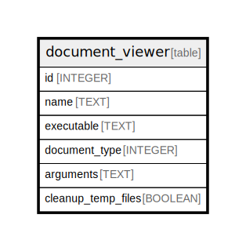

# document_viewer

## Description

<details>
<summary><strong>Table Definition</strong></summary>

```sql
CREATE TABLE document_viewer (
    id INTEGER PRIMARY KEY AUTOINCREMENT NOT NULL,
    name TEXT NOT NULL,
    executable TEXT NOT NULL,
    document_type INTEGER NOT NULL,
    arguments TEXT NOT NULL
, cleanup_temp_files BOOLEAN NOT NULL DEFAULT FALSE)
```

</details>

## Columns

| Name | Type | Default | Nullable | Children | Parents | Comment |
| ---- | ---- | ------- | -------- | -------- | ------- | ------- |
| id | INTEGER |  | false |  |  |  |
| name | TEXT |  | false |  |  |  |
| executable | TEXT |  | false |  |  |  |
| document_type | INTEGER |  | false |  |  |  |
| arguments | TEXT |  | false |  |  |  |
| cleanup_temp_files | BOOLEAN | FALSE | false |  |  |  |

## Constraints

| Name | Type | Definition |
| ---- | ---- | ---------- |
| id | PRIMARY KEY | PRIMARY KEY (id) |

## Relations



---

> Generated by [tbls](https://github.com/k1LoW/tbls)
