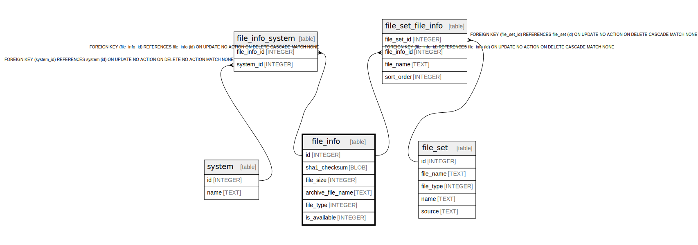

# file_info

## Description

<details>
<summary><strong>Table Definition</strong></summary>

```sql
CREATE TABLE file_info (
    id INTEGER PRIMARY KEY AUTOINCREMENT NOT NULL,
    sha1_checksum BLOB NOT NULL,
    file_size INTEGER NOT NULL,
    archive_file_name TEXT NOT NULL
, file_type INTEGER)
```

</details>

## Columns

| Name | Type | Default | Nullable | Children | Parents | Comment |
| ---- | ---- | ------- | -------- | -------- | ------- | ------- |
| id | INTEGER |  | false | [file_set_file_info](file_set_file_info.md) [file_info_system](file_info_system.md) |  |  |
| sha1_checksum | BLOB |  | false |  |  |  |
| file_size | INTEGER |  | false |  |  |  |
| archive_file_name | TEXT |  | false |  |  |  |
| file_type | INTEGER |  | true |  |  |  |

## Constraints

| Name | Type | Definition |
| ---- | ---- | ---------- |
| id | PRIMARY KEY | PRIMARY KEY (id) |

## Relations



---

> Generated by [tbls](https://github.com/k1LoW/tbls)
