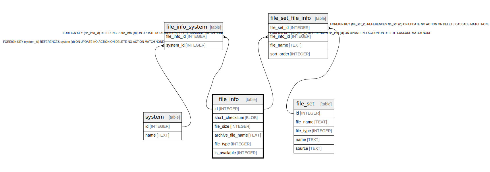

# file_info

## Description

Metadata about files including checksums and sizes

<details>
<summary><strong>Table Definition</strong></summary>

```sql
CREATE TABLE "file_info" (
    id                INTEGER PRIMARY KEY AUTOINCREMENT NOT NULL,
    sha1_checksum     BLOB    NOT NULL,
    file_size         INTEGER NOT NULL,
    archive_file_name TEXT,
    file_type         INTEGER,
    is_available      INTEGER NOT NULL DEFAULT 0
, cloud_sync_status INTEGER NOT NULL DEFAULT 0)
```

</details>

## Columns

| Name | Type | Default | Nullable | Children | Parents | Comment |
| ---- | ---- | ------- | -------- | -------- | ------- | ------- |
| id | INTEGER |  | false | [file_info_system](file_info_system.md) [file_set_file_info](file_set_file_info.md) |  |  |
| sha1_checksum | BLOB |  | false |  |  |  |
| file_size | INTEGER |  | false |  |  |  |
| archive_file_name | TEXT |  | true |  |  |  |
| file_type | INTEGER |  | true |  |  |  |
| is_available | INTEGER | 0 | false |  |  |  |
| cloud_sync_status | INTEGER | 0 | false |  |  |  |

## Constraints

| Name | Type | Definition |
| ---- | ---- | ---------- |
| id | PRIMARY KEY | PRIMARY KEY (id) |

## Relations



---

> Generated by [tbls](https://github.com/k1LoW/tbls)
