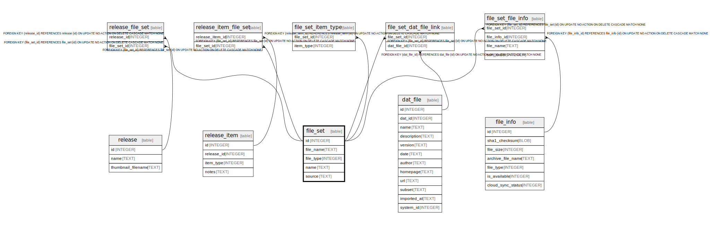

# file_set

## Description

<details>
<summary><strong>Table Definition</strong></summary>

```sql
CREATE TABLE file_set (
    id INTEGER PRIMARY KEY AUTOINCREMENT NOT NULL,
    file_name TEXT NOT NULL,
    file_type INTEGER NOT NULL,
    name TEXT NOT NULL
 , source TEXT NOT NULL DEFAULT '')
```

</details>

## Columns

| Name | Type | Default | Nullable | Children | Parents | Comment |
| ---- | ---- | ------- | -------- | -------- | ------- | ------- |
| id | INTEGER |  | false | [file_set_file_info](file_set_file_info.md) [release_file_set](release_file_set.md) |  |  |
| file_name | TEXT |  | false |  |  |  |
| file_type | INTEGER |  | false |  |  |  |
| name | TEXT |  | false |  |  |  |
| source | TEXT | '' | false |  |  |  |

## Constraints

| Name | Type | Definition |
| ---- | ---- | ---------- |
| id | PRIMARY KEY | PRIMARY KEY (id) |

## Relations



---

> Generated by [tbls](https://github.com/k1LoW/tbls)
