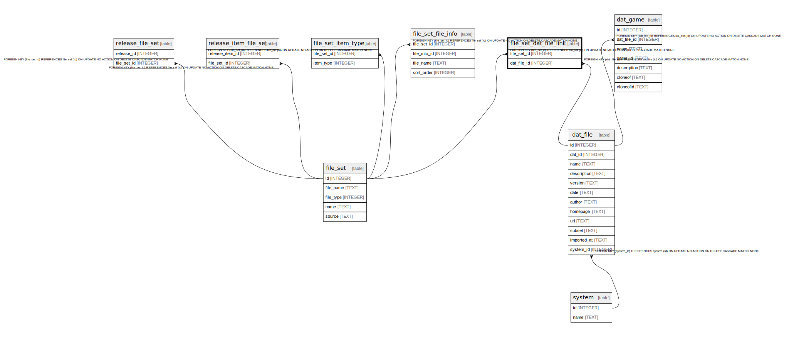

# file_set_dat_file_link

## Description

<details>
<summary><strong>Table Definition</strong></summary>

```sql
CREATE TABLE file_set_dat_file_link (
    file_set_id INTEGER NOT NULL,
    dat_file_id INTEGER NOT NULL,
    PRIMARY KEY (file_set_id, dat_file_id),
    FOREIGN KEY (file_set_id) REFERENCES file_set(id) ON DELETE CASCADE,
    FOREIGN KEY (dat_file_id) REFERENCES dat_file(id) ON DELETE CASCADE
)
```

</details>

## Columns

| Name | Type | Default | Nullable | Children | Parents | Comment |
| ---- | ---- | ------- | -------- | -------- | ------- | ------- |
| file_set_id | INTEGER |  | false |  | [file_set](file_set.md) |  |
| dat_file_id | INTEGER |  | false |  | [dat_file](dat_file.md) |  |

## Constraints

| Name | Type | Definition |
| ---- | ---- | ---------- |
| file_set_id | PRIMARY KEY | PRIMARY KEY (file_set_id) |
| dat_file_id | PRIMARY KEY | PRIMARY KEY (dat_file_id) |
| - (Foreign key ID: 0) | FOREIGN KEY | FOREIGN KEY (dat_file_id) REFERENCES dat_file (id) ON UPDATE NO ACTION ON DELETE CASCADE MATCH NONE |
| - (Foreign key ID: 1) | FOREIGN KEY | FOREIGN KEY (file_set_id) REFERENCES file_set (id) ON UPDATE NO ACTION ON DELETE CASCADE MATCH NONE |
| sqlite_autoindex_file_set_dat_file_link_1 | PRIMARY KEY | PRIMARY KEY (file_set_id, dat_file_id) |

## Indexes

| Name | Definition |
| ---- | ---------- |
| sqlite_autoindex_file_set_dat_file_link_1 | PRIMARY KEY (file_set_id, dat_file_id) |

## Relations



---

> Generated by [tbls](https://github.com/k1LoW/tbls)
