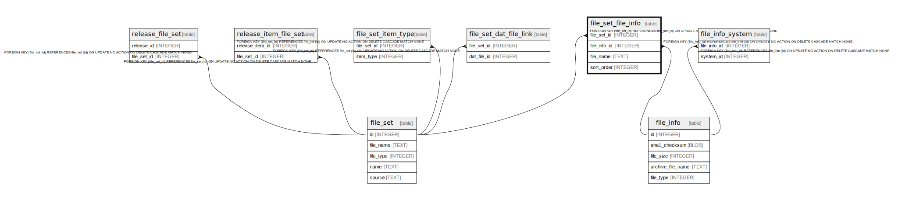

# file_set_file_info

## Description

<details>
<summary><strong>Table Definition</strong></summary>

```sql
CREATE TABLE file_set_file_info (
    file_set_id INTEGER NOT NULL,
    file_info_id INTEGER NOT NULL,
    -- same file can have different names in different file sets 
    file_name TEXT NOT NULL,
    PRIMARY KEY (file_set_id, file_info_id),
    FOREIGN KEY (file_set_id) REFERENCES file_set(id),
    FOREIGN KEY (file_info_id) REFERENCES file_info(id)
)
```

</details>

## Columns

| Name | Type | Default | Nullable | Children | Parents | Comment |
| ---- | ---- | ------- | -------- | -------- | ------- | ------- |
| file_set_id | INTEGER |  | false |  | [file_set](file_set.md) |  |
| file_info_id | INTEGER |  | false |  | [file_info](file_info.md) |  |
| file_name | TEXT |  | false |  |  |  |

## Constraints

| Name | Type | Definition |
| ---- | ---- | ---------- |
| file_set_id | PRIMARY KEY | PRIMARY KEY (file_set_id) |
| file_info_id | PRIMARY KEY | PRIMARY KEY (file_info_id) |
| - (Foreign key ID: 0) | FOREIGN KEY | FOREIGN KEY (file_info_id) REFERENCES file_info (id) ON UPDATE NO ACTION ON DELETE NO ACTION MATCH NONE |
| - (Foreign key ID: 1) | FOREIGN KEY | FOREIGN KEY (file_set_id) REFERENCES file_set (id) ON UPDATE NO ACTION ON DELETE NO ACTION MATCH NONE |
| sqlite_autoindex_file_set_file_info_1 | PRIMARY KEY | PRIMARY KEY (file_set_id, file_info_id) |

## Indexes

| Name | Definition |
| ---- | ---------- |
| sqlite_autoindex_file_set_file_info_1 | PRIMARY KEY (file_set_id, file_info_id) |

## Relations



---

> Generated by [tbls](https://github.com/k1LoW/tbls)
