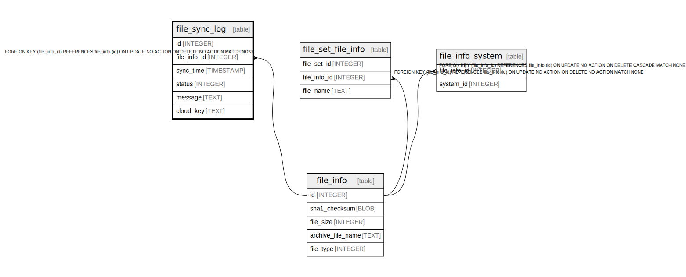

# file_sync_log

## Description

<details>
<summary><strong>Table Definition</strong></summary>

```sql
CREATE TABLE file_sync_log (
    id INTEGER PRIMARY KEY AUTOINCREMENT NOT NULL,
    file_info_id INTEGER NOT NULL,
    sync_time TIMESTAMP NOT NULL DEFAULT CURRENT_TIMESTAMP,
    status INTEGER NOT NULL,
    message TEXT NOT NULL DEFAULT '',
    cloud_key TEXT NOT NULL,
    FOREIGN KEY (file_info_id) REFERENCES file_info(id)
)
```

</details>

## Columns

| Name | Type | Default | Nullable | Children | Parents | Comment |
| ---- | ---- | ------- | -------- | -------- | ------- | ------- |
| id | INTEGER |  | false |  |  |  |
| file_info_id | INTEGER |  | false |  | [file_info](file_info.md) |  |
| sync_time | TIMESTAMP | CURRENT_TIMESTAMP | false |  |  |  |
| status | INTEGER |  | false |  |  |  |
| message | TEXT | '' | false |  |  |  |
| cloud_key | TEXT |  | false |  |  |  |

## Constraints

| Name | Type | Definition |
| ---- | ---- | ---------- |
| id | PRIMARY KEY | PRIMARY KEY (id) |
| - (Foreign key ID: 0) | FOREIGN KEY | FOREIGN KEY (file_info_id) REFERENCES file_info (id) ON UPDATE NO ACTION ON DELETE NO ACTION MATCH NONE |

## Relations



---

> Generated by [tbls](https://github.com/k1LoW/tbls)
