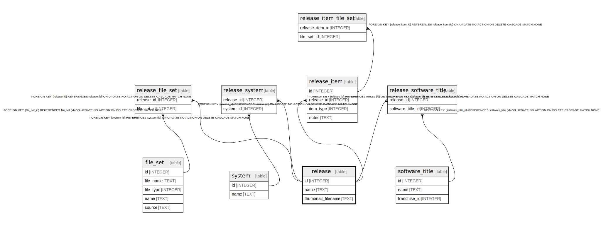

# release

## Description

Specific releases of software (versions, editions, regions, compilations, different media)

<details>
<summary><strong>Table Definition</strong></summary>

```sql
CREATE TABLE release (
    id INTEGER PRIMARY KEY AUTOINCREMENT NOT NULL,
    name TEXT NOT NULL
, thumbnail_filename TEXT)
```

</details>

## Columns

| Name | Type | Default | Nullable | Children | Parents | Comment |
| ---- | ---- | ------- | -------- | -------- | ------- | ------- |
| id | INTEGER |  | false | [release_file_set](release_file_set.md) [release_system](release_system.md) [release_software_title](release_software_title.md) [release_item](release_item.md) |  |  |
| name | TEXT |  | false |  |  |  |
| thumbnail_filename | TEXT |  | true |  |  |  |

## Constraints

| Name | Type | Definition |
| ---- | ---- | ---------- |
| id | PRIMARY KEY | PRIMARY KEY (id) |

## Relations



---

> Generated by [tbls](https://github.com/k1LoW/tbls)
