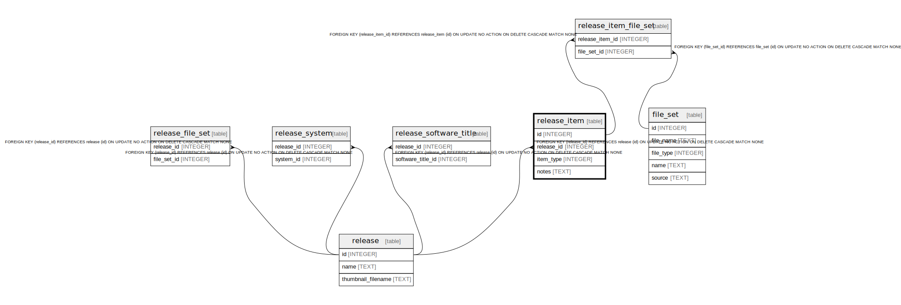

# release_item

## Description

<details>
<summary><strong>Table Definition</strong></summary>

```sql
CREATE TABLE release_item (
    id INTEGER PRIMARY KEY AUTOINCREMENT NOT NULL,
    release_id INTEGER NOT NULL,
    item_type INTEGER NOT NULL,
    notes TEXT,
    FOREIGN KEY (release_id) REFERENCES release(id) ON DELETE CASCADE
)
```

</details>

## Columns

| Name | Type | Default | Nullable | Children | Parents | Comment |
| ---- | ---- | ------- | -------- | -------- | ------- | ------- |
| id | INTEGER |  | false | [file_set_item](file_set_item.md) |  |  |
| release_id | INTEGER |  | false |  | [release](release.md) |  |
| item_type | INTEGER |  | false |  |  |  |
| notes | TEXT |  | true |  |  |  |

## Constraints

| Name | Type | Definition |
| ---- | ---- | ---------- |
| id | PRIMARY KEY | PRIMARY KEY (id) |
| - (Foreign key ID: 0) | FOREIGN KEY | FOREIGN KEY (release_id) REFERENCES release (id) ON UPDATE NO ACTION ON DELETE CASCADE MATCH NONE |

## Relations



---

> Generated by [tbls](https://github.com/k1LoW/tbls)
