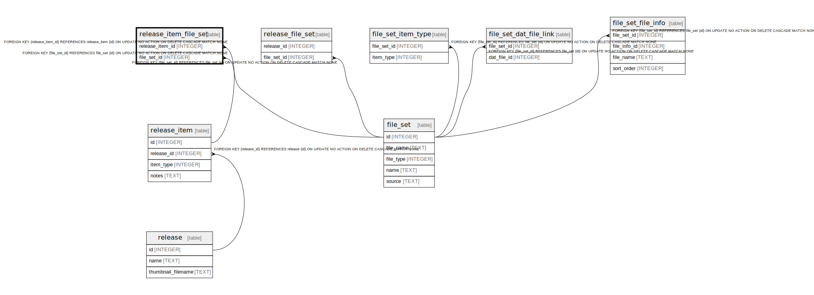

# release_item_file_set

## Description

<details>
<summary><strong>Table Definition</strong></summary>

```sql
CREATE TABLE release_item_file_set (
    release_item_id INTEGER NOT NULL,
    file_set_id INTEGER NOT NULL,
    PRIMARY KEY (release_item_id, file_set_id),
    FOREIGN KEY (release_item_id) REFERENCES release_item(id) ON DELETE CASCADE,
    FOREIGN KEY (file_set_id) REFERENCES file_set(id) ON DELETE CASCADE
)
```

</details>

## Columns

| Name | Type | Default | Nullable | Children | Parents | Comment |
| ---- | ---- | ------- | -------- | -------- | ------- | ------- |
| release_item_id | INTEGER |  | false |  | [release_item](release_item.md) |  |
| file_set_id | INTEGER |  | false |  | [file_set](file_set.md) |  |

## Constraints

| Name | Type | Definition |
| ---- | ---- | ---------- |
| release_item_id | PRIMARY KEY | PRIMARY KEY (release_item_id) |
| file_set_id | PRIMARY KEY | PRIMARY KEY (file_set_id) |
| - (Foreign key ID: 0) | FOREIGN KEY | FOREIGN KEY (file_set_id) REFERENCES file_set (id) ON UPDATE NO ACTION ON DELETE CASCADE MATCH NONE |
| - (Foreign key ID: 1) | FOREIGN KEY | FOREIGN KEY (release_item_id) REFERENCES release_item (id) ON UPDATE NO ACTION ON DELETE CASCADE MATCH NONE |
| sqlite_autoindex_release_item_file_set_1 | PRIMARY KEY | PRIMARY KEY (release_item_id, file_set_id) |

## Indexes

| Name | Definition |
| ---- | ---------- |
| sqlite_autoindex_release_item_file_set_1 | PRIMARY KEY (release_item_id, file_set_id) |

## Relations



---

> Generated by [tbls](https://github.com/k1LoW/tbls)
