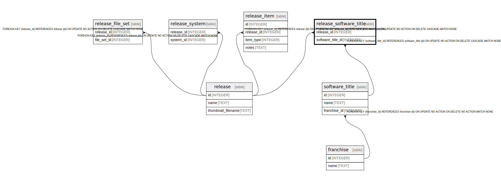

# release_software_title

## Description

<details>
<summary><strong>Table Definition</strong></summary>

```sql
CREATE TABLE "release_software_title" (
    release_id INTEGER NOT NULL,
    software_title_id INTEGER NOT NULL,
    PRIMARY KEY (release_id, software_title_id),
    FOREIGN KEY (release_id) REFERENCES release(id) ON DELETE CASCADE,
    FOREIGN KEY (software_title_id) REFERENCES software_title(id) ON DELETE CASCADE
)
```

</details>

## Columns

| Name | Type | Default | Nullable | Children | Parents | Comment |
| ---- | ---- | ------- | -------- | -------- | ------- | ------- |
| release_id | INTEGER |  | false |  | [release](release.md) |  |
| software_title_id | INTEGER |  | false |  | [software_title](software_title.md) |  |

## Constraints

| Name | Type | Definition |
| ---- | ---- | ---------- |
| release_id | PRIMARY KEY | PRIMARY KEY (release_id) |
| software_title_id | PRIMARY KEY | PRIMARY KEY (software_title_id) |
| - (Foreign key ID: 0) | FOREIGN KEY | FOREIGN KEY (software_title_id) REFERENCES software_title (id) ON UPDATE NO ACTION ON DELETE CASCADE MATCH NONE |
| - (Foreign key ID: 1) | FOREIGN KEY | FOREIGN KEY (release_id) REFERENCES release (id) ON UPDATE NO ACTION ON DELETE CASCADE MATCH NONE |
| sqlite_autoindex_release_software_title_1 | PRIMARY KEY | PRIMARY KEY (release_id, software_title_id) |

## Indexes

| Name | Definition |
| ---- | ---------- |
| sqlite_autoindex_release_software_title_1 | PRIMARY KEY (release_id, software_title_id) |

## Relations



---

> Generated by [tbls](https://github.com/k1LoW/tbls)
