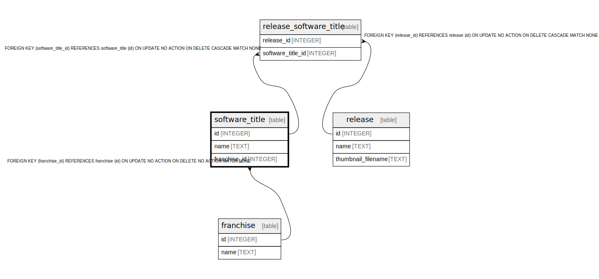

# software_title

## Description

<details>
<summary><strong>Table Definition</strong></summary>

```sql
CREATE TABLE software_title (
    id INTEGER PRIMARY KEY AUTOINCREMENT NOT NULL,
    name TEXT NOT NULL,
    franchise_id INTEGER,
    FOREIGN KEY (franchise_id) REFERENCES franchise(id)
)
```

</details>

## Columns

| Name | Type | Default | Nullable | Children | Parents | Comment |
| ---- | ---- | ------- | -------- | -------- | ------- | ------- |
| id | INTEGER |  | false | [release_software_title](release_software_title.md) |  |  |
| name | TEXT |  | false |  |  |  |
| franchise_id | INTEGER |  | true |  | [franchise](franchise.md) |  |

## Constraints

| Name | Type | Definition |
| ---- | ---- | ---------- |
| id | PRIMARY KEY | PRIMARY KEY (id) |
| - (Foreign key ID: 0) | FOREIGN KEY | FOREIGN KEY (franchise_id) REFERENCES franchise (id) ON UPDATE NO ACTION ON DELETE NO ACTION MATCH NONE |

## Relations



---

> Generated by [tbls](https://github.com/k1LoW/tbls)
