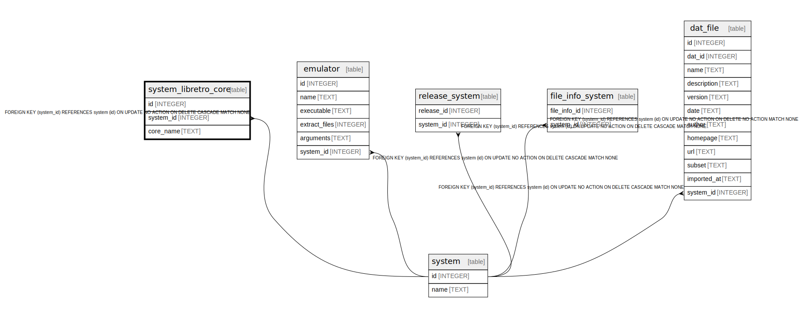

# system_libretro_core

## Description

<details>
<summary><strong>Table Definition</strong></summary>

```sql
CREATE TABLE "system_libretro_core" (
    id        INTEGER PRIMARY KEY AUTOINCREMENT NOT NULL,
    system_id INTEGER NOT NULL REFERENCES system(id) ON DELETE CASCADE,
    core_name TEXT NOT NULL,
    UNIQUE(system_id, core_name)
)
```

</details>

## Columns

| Name | Type | Default | Nullable | Children | Parents | Comment |
| ---- | ---- | ------- | -------- | -------- | ------- | ------- |
| id | INTEGER |  | false |  |  |  |
| system_id | INTEGER |  | false |  | [system](system.md) |  |
| core_name | TEXT |  | false |  |  |  |

## Constraints

| Name | Type | Definition |
| ---- | ---- | ---------- |
| id | PRIMARY KEY | PRIMARY KEY (id) |
| - (Foreign key ID: 0) | FOREIGN KEY | FOREIGN KEY (system_id) REFERENCES system (id) ON UPDATE NO ACTION ON DELETE CASCADE MATCH NONE |
| sqlite_autoindex_system_libretro_core_1 | UNIQUE | UNIQUE (system_id, core_name) |

## Indexes

| Name | Definition |
| ---- | ---------- |
| sqlite_autoindex_system_libretro_core_1 | UNIQUE (system_id, core_name) |

## Relations



---

> Generated by [tbls](https://github.com/k1LoW/tbls)
